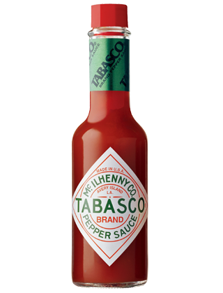

# 🗻 *The* **Flaming Ultimate Climber** *of* **Kentucky** 🔥

The Flaming Ultimate Climber of Kentucky is a game about a hero that is tasked with delivering the olympic flame to various mountain altars, in rythm with some sick beats !

# **Gameplay** 🕹️

The game is a 2D platformer where the player must climb a mountain while avoiding obstacles and enemies.

In your quest you will encounter moutain altars where you must deliver the olympic flame. They will act as checkpoints and will allow you to respawn there if you die.

In your adventure you will also find lots of collectibles and powerups that will help you in your quest.

# **Controls** 🎮

- **A/D**: Move left/right
- **Space**: Jump
- **Mouse movement**: move your arms
- **Left click**: grab onto a grabbable object
- **Right click**: rock !!!
- **escape**: pause

# **Installation** 📦

To install the game, simply download the latest release from the releases page. Then, run the executable file to start the game.

[***Download the latest release***](https://github.com/alexishachemi/the-Flaming-Ultimate-Climber-of-Kentucky/releases)

